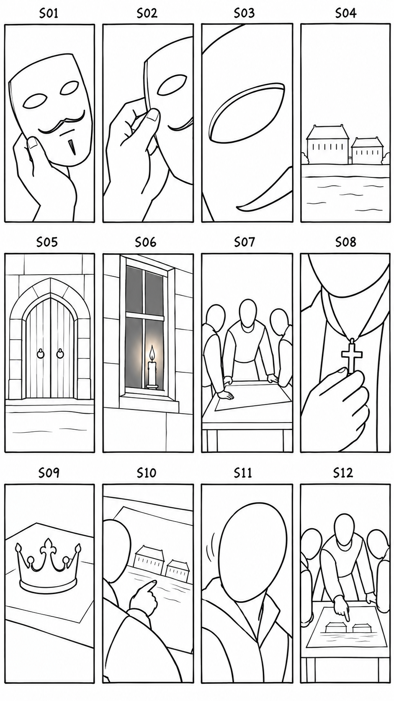
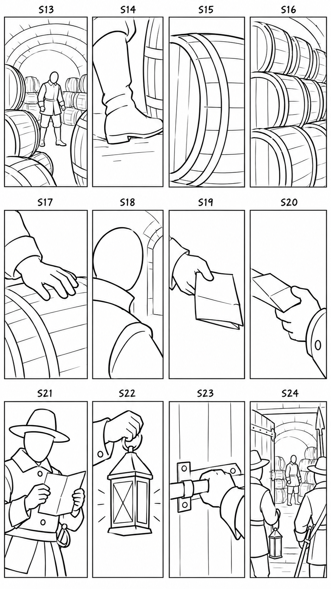
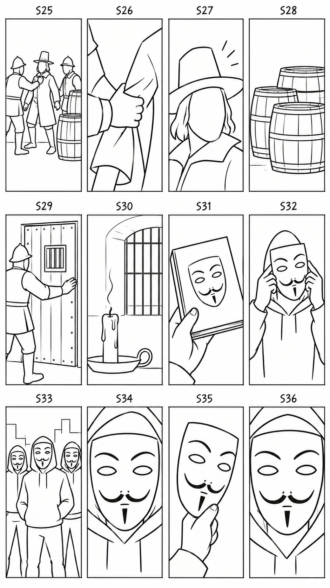

# نمونهٔ ۰۰۷ — بستهٔ بازبینی سناریو و استوری‌بورد

هدف فعلی: شورت عمودی اسپانیایی، حدود **۳۰ ثانیه**. مدت و کات‌های دقیق بعد از
دریافت ویس واقعی و استخراج تایم‌استمپ‌های آن قطعی می‌شوند.

داستان پیشنهادی: ماسک آشنا → لندن ۱۶۰۵ و توطئه → فاکس و باروت → نامه و جست‌وجو
→ دستگیری و شکست → بازگشت ماسک در دنیای امروز. پایان با بازی معنایی باروتی که
منفجر نشد و تصویری که جهانی شد، به شروع برمی‌گردد.

- [متن اسپانیایی](../script/narration-es.md)
- [ترجمهٔ فارسی برای بررسی معنا](../script/narration-fa-review.md)
- [سناریو و تصمیم‌های اقتباس](scenario.md)
- [تحلیل زمان‌دار ویدیوی مرجع](reference-video-analysis.md)

اسکچ‌ها فقط ترکیب‌بندی، سوژه‌ها و ترتیب روایت را نشان می‌دهند؛ چهره، لباس و
ظاهر نهایی کاراکترها هنوز طراحی نشده. هر صفحه ۱۲ پنل دارد، از چپ به راست و
از بالا به پایین. ۳۶ پنل، پوشش پیشنهادی‌اند؛ تعداد نهایی کات‌ها با ویس و توان
موتور بازبینی می‌شود.

| صفحه | نماها | بخش داستان |
| --- | --- | --- |
| [۱](storyboard/storyboard-page-01-r002.png) | S01–S12 | ماسک، ورود به تاریخ، تصمیم توطئه‌گران |
| [۲](storyboard/storyboard-page-02-r002.png) | S13–S24 | باروت، نامه، جست‌وجو و کشف |
| [۳](storyboard/storyboard-page-03-r002.png) | S25–S36 | دستگیری، پیامد، ماسک امروزی و پایان |

در بخش پیامد، شمع خاموش نشانهٔ نمادین اعدام بعدی است؛ صحنهٔ بازسازیِ شیوهٔ
اعدام نیست. قاب آخر، تکرار بصری ماسک است و هنوز لوپ دقیق فریم‌به‌فریم نیست.
جزئیات بررسی تصاویر و محدودیت‌ها در [گزارش بازبینی](storyboard/review.md) آمده.

مطابق مرحله‌ای که تعیین کردی، ساخت رفرنس‌های تولیدی بعد از تأیید سناریو و
استوری‌بورد انجام می‌شود. سپس متن دقیق برای ویس تثبیت می‌شود، ویس را تو
می‌دهی، و با آجیل زمان‌بندی واقعی آن را استخراج می‌کنیم. رفرنس‌ها تک‌تصویر
و کاملاً در دنیای استیک خواهند بود؛ این صفحات ورودی موتور ویدیو نیستند.

متن مخصوص ویس هم آماده است: [نسخهٔ تگ‌دار Google Vids](../script/voiceover-google-vids-es.md).
همین محتوا را کپی کن؛ نسخهٔ جدید، دعوت کوتاه «سابسکرایب کن» را هم در پایان دارد و ۳۰ تگ برای اجرای سریع و
پراحساس اضافه شده. زمان نهایی بعد از دریافت و بررسی فایل صوتی مشخص می‌شود.
