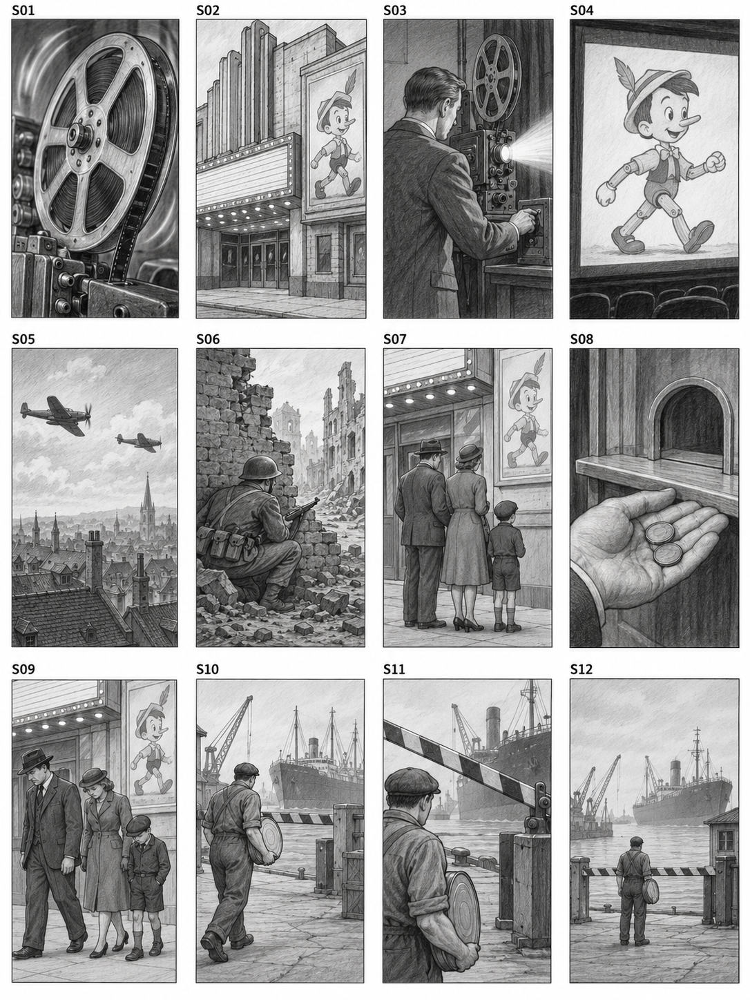
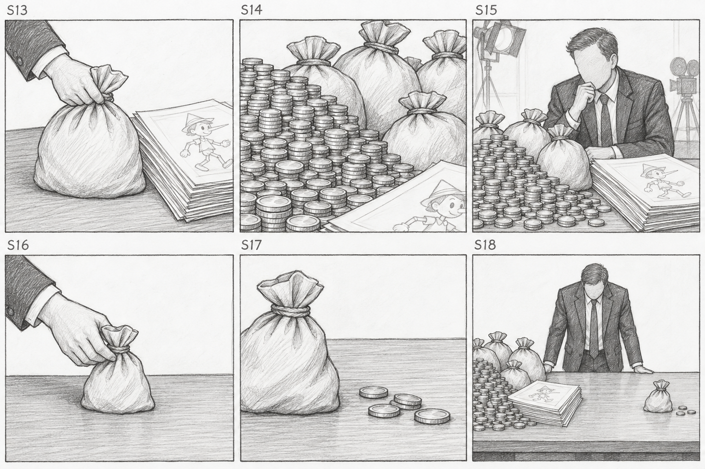
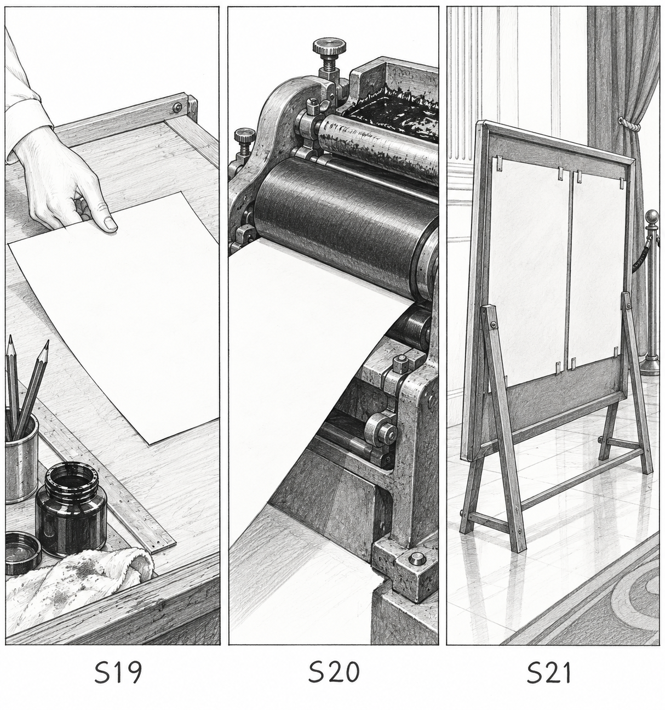
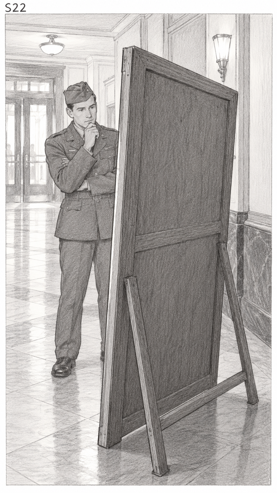
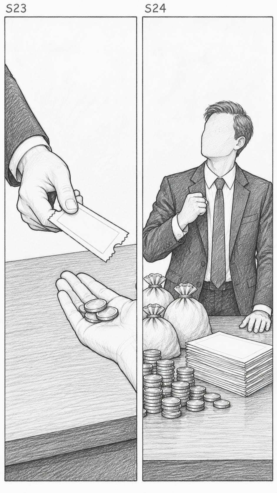
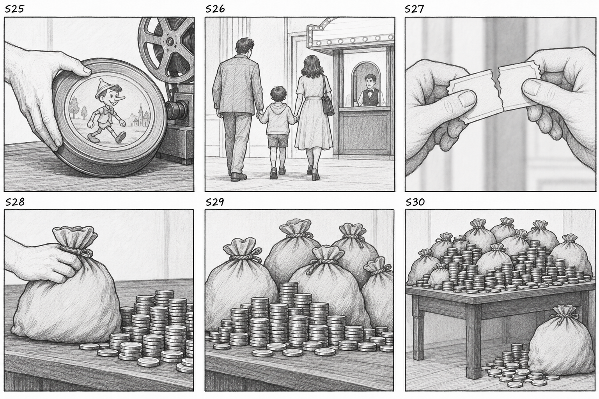
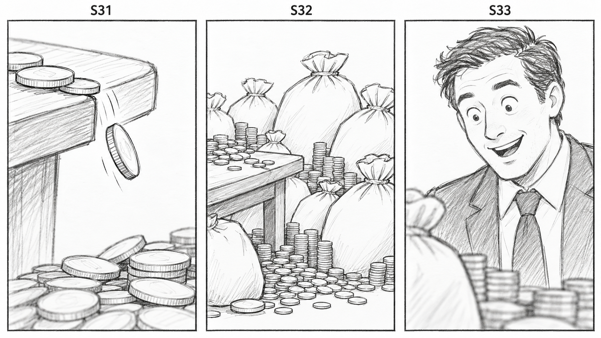
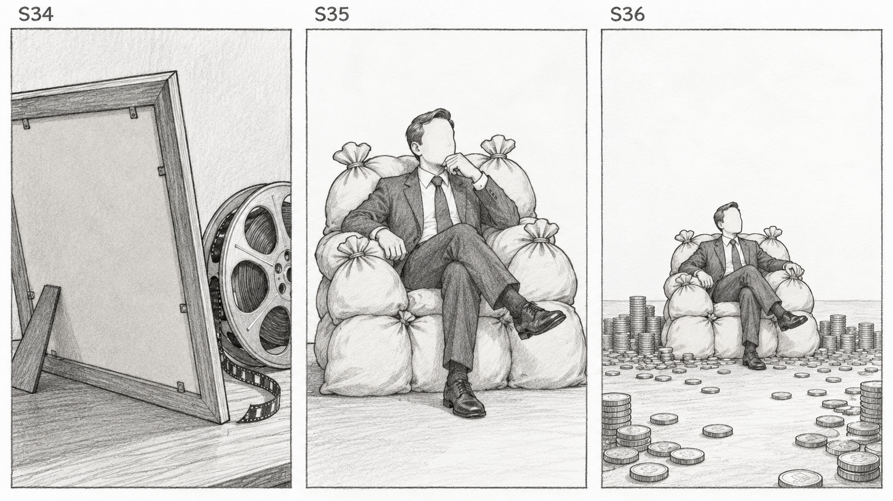

# استوری‌بورد کامل برای بررسی

۳۶ نما در ۸ تصویر، بر اساس صدای تحویلی ۳۲٫۱۷ ثانیه‌ای.
تمام پنل‌های منتخب بررسی شده‌اند؛ این‌ها طرح ترکیب‌بندی‌اند و هنوز تأیید
تولید، هویت شخصیت یا استایل نهایی نیستند.

متن، عددهای ۲٫۶، ۱٫۴ و ۸۴ میلیون، سال‌ها و نقش تبلیغات نظامی حفظ شده‌اند.
راستی‌آزمایی جدیدی انجام نشده و صدا کوتاه یا تند نشده است.

برای تکمیل تصویرها، نماهای S19–S22 و S34 با آماده‌سازی/چاپ/نمایش برگه‌های
تبلیغاتی و زاویهٔ پشت قاب بازطراحی شده‌اند؛ جزئیات چهرهٔ شخصیت‌های چاپی در
این نماها دیده نمی‌شود. فرایند چاپ تصویرسازی روایت است، نه سند تاریخی تازه.

## متن روایت

En mil novecientos cuarenta, Disney estrenó Pinocho en plena Segunda Guerra Mundial. Las familias tenían menos dinero y la guerra frenó su distribución internacional. Costó dos coma seis millones de dólares, pero recaudó solo uno coma cuatro en su estreno. Después, Pinocho y otros personajes de Disney participaron en propaganda militar. Eso impulsó su recuperación: para mil novecientos cuarenta y cinco, acumulaba ochenta y cuatro millones de dólares en beneficios. ¿La mejor campaña de marketing? Suscríbete.

## تصاویر به ترتیب روایت

### 1. شروع و جنگ / دشواری مالی و توزیع — S01، S02، S03، S04، S05، S06، S07، S08، S09، S10، S11، S12

### 2. هزینه در برابر فروش اولیه — S13، S14، S15، S16، S17، S18

### 3. آماده‌سازی، چاپ و نمایش — S19، S20، S21

### 4. مخاطب نظامی در برابر پوستر — S22

### 5. فروش بلیت و واکنش تهیه‌کننده — S23، S24

### 6. بازگشت مخاطبان و افزایش درآمد — S25، S26، S27، S28، S29، S30

### 7. سکه‌ها و واکنش به موفقیت — S31، S32، S33

### 8. یادآوری تبلیغات و پایان با صندلی پول — S34، S35، S36

## بررسی و محدودیت‌های طرح

تمام ۳۶ شناسه به تصویر واقعی، بازهٔ زمانی صدای واقعی، شمارهٔ پنل و گزارش
بررسی وصل‌اند. فهرست دقیق: `shot-list.json`؛ هش تصاویر و درخواست‌ها:
`artifact-manifest-r001.json`؛ یادداشت تک‌تک پنل‌ها: فایل‌های `review-*.json`.

S19–S21 از سه برگهٔ مشابه به سه ترکیب متفاوتِ آماده‌سازی، غلتک چاپ و نمایش
تغییر کرد. S22 اصلاح شد تا سرباز روبه‌روی پوستر و دوربین پشت قاب باشد؛
نسخهٔ قبلی که سرباز به پشت پوستر نگاه می‌کرد رد و جداگانه حفظ شد.
S26 شامل سه عضو خانواده و یک فروشندهٔ بلیت است؛ S28 دستِ گذاشتن کیسه را
نشان می‌دهد. این تغییرات موجودی به‌صراحت در فهرست نماها ثبت شده‌اند.

بعضی تصویرها سایه‌زنی، جزئیات چهره/لباس یا نسبت قاب بیشتری از طرح خنثی
خواسته‌شده دارند. فقط ترکیب‌بندی و موجودی آن‌ها برای این مرحله پذیرفته شده؛
قاب تولید نهایی ۹:۱۶ و استایل، هویت و جزئیات لباس نیازمند مرجع تولید مستقل‌اند.
نقش‌های تزئینی روی بعضی سکه‌ها مجوز متن خوانا نیست؛ سکه‌های تولید باید بی‌نوشته
باشند. تصاویر ثابت اجرای حرکت یا نسبت دقیق مبلغ‌ها را اثبات نمی‌کنند.

## سابقهٔ درخواست‌ها

صفحهٔ اول r002 حفظ شد. انتظار محلی r003 با درخواست کاربر خاتمه یافت؛ لغو
پردازش از راه دور ادعا نشده است. تلاش‌های r004/r005 دو صفحهٔ جدید ساختند،
اما صفحات پوستر/پایان رد شدند. پس از رد مسیر API توسط کاربر، چهار طرح
سه‌پنلی r006/r007 و سپس درخواست‌های مبتنی بر مرجع r008 امتحان شدند.
نماهای بدون جزئیات کارتونی ساخته شدند؛ درخواست‌های باقی‌مانده با خطای
HTTP 400 `moderation_blocked` و تنها دستهٔ `other` رد شدند. دلیل مشخصی ارائه
نشد. درخواست‌ها و شناسهٔ خطاها در فایل‌های provenance/result محفوظ‌اند.

زاویه‌های پشت/کنار برگه‌ها در r009 خروجی دادند. r010 تنوع نماهای چاپ و
رابطهٔ مکانی سرباز/پوستر را اصلاح کرد. هیچ API جایگزینی اجرا نشده است.
گزینه‌های ضعیف‌تر و خطاهای ابزار حذف نشده‌اند.

## مرحلهٔ بعد

بازبینی واقعی سناریو و استوری‌بورد توسط کاربر، سپس طراحی و ساخت مراجع
تولید. این طرح‌ها به‌عنوان مرجع H3 استفاده نمی‌شوند. هنوز هیچ مرجع تولید،
پرامپت نهایی ویدیو، job، رندر یا مستر تأییدشده‌ای ساخته نشده است.
